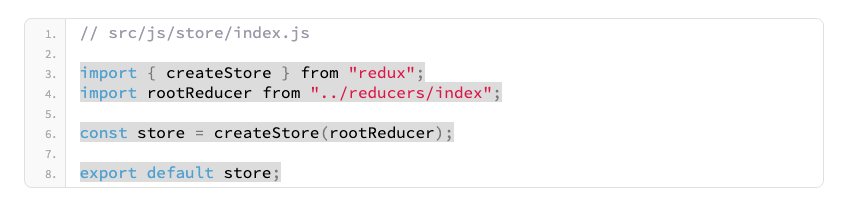

https://www.valentinog.com/blog/redux/

# Redux

Redux holds state within a single location.

The logic for fetching and managing steate lives outside React.

Use redux when 
1. multiple React components need to access the same state, but do not have any parent/child relationship
2. passing down state to multiple components become awkward.

---
## Store

The store orchestrates all the moving parts (actions, reducers) in Redux.

The store is like the brain or controller.

`As soon as the store receives an action it triggers a reducer`

Start by installing redux `npm i redux --save`.

Then create the store.  Usually within the `src`, add a folder `js`, then folder `store` and create a `index.js` file.

Use `createStore` from the redux library.

createStore is a function, takes a reducer as its first argument.

`Concept`: the state in redux comes from reducers.  Reducers produce the state of the application.

---
### Reducers

In redux, state must return entirely from reducers.  

Reducers are responsible for updating state.

Reducers are JS function, which takes 2 parameters
1. the current state
2. an action

State is immutable.  Use a reducer which is a `pure function` that returns the exact same output for the given input.

`pure function`, given the same input, always returns the same output with no side effects.  

`Mutating` the original state (array/object) is a `side effect`.    

Impure function examples may have date/time parts, random numbers within the function.    

Passing in an object or array, this is passing a reference to the original object.  Thus any changes to the the object/array is altering the orginal state outside of the function, and is therefore a side effect.

In `src/js`, create a `reducers` folder, and `index.js` file.  This is where the rootReducer will be created.

This rootReducer does nothing, just returns the initial state.

This is also imported into `store/index.js` to be used with the `createStore` function.
     

---
### Actions

Action objects get passed into the reducers.  

Actions say this what we want changed, and this is what the value we want it changed to.

`Dispatching actions` is process of sending a signal to the store.

Redux actions are JS objects containing
1. `type` property desribing how the state should be changed eg. 'ADD_ARTICLE'
2. `payload` property which is the data.

Best practise is to wrap every action within a function, called an `action creator`.

In `src/js`, create an `actions` folder, then an `index.js` file.

The `type` property is a simple string, which the reducer will use to determine how to calculate the next state.

Because strings are prone to typos, declared types separately once.  Do this by creating a `constants` folder, `action-types.js`.

Then import back into the action. 

Now all `action types` can be isolated in this single `action-types.js` file.  Types are important as they are used, usually in a JS switch or if/else statements to determine how the reducer operates.

---

A reducer function uses either a switch or if/else statements for handling every action type.

Depending on the action type, the reducer calculates the next state.  By default, if no action type is matched, it should return the current state.

When the action type is matched in the reducer, the reducer should calculate the next state and return a new object.

In the `reducers/index.js` we can do something other than just returning the original state.

Here, use `Object.assign` to create a new object of merging an empty object, the initial state, and assignment using the concat method (so not to mutate the initial array).

---
Redux Store Methods

Play with redux in the console (nothing to do with React yet).

Most important are
1. getState for accessing the current state
2. dispatch for dispatching actions
3. subscribe for listening for changes in state

In `src/js` create a `index.js` file.

Here, we binrg together the created store, and actions.

In the `src/index.js` file, we can import this file    
`import index from './js/index';`

Run the application `npm start` and in the console access the current state `store.getState()`

Listen for state updates with `subscribe`.

In the console, register the callback.
`store.subscribe(()=> console.log('Look, Redux!!'))`

To change the state, we must `dispatch an action`, using the dispatch method.
`store.dispatch(addArticle({title: 'React/Redux Tutorial',id: 1}))`

---

### React-Redux

Use `npm react-redux --save`.  This provides bindings between React and Redux to call getState(), etc.

`connect` method, to link a React component to the Redux store.

Fundamental functions
1. mapStateToProps
2. mapDispatchToProps

`mapStateToProps` connects a part of the Redux state to the props of a React component.

`mapDispatchToProps` connects Redux actions to React props.  This allows a connection React component to dispath a Redux action.

---

Even if you use mapStateToProps, React is not aware of the new global state.  To make React aware of Redux we use a `Provider` which is a higher-order component from the react-redux library.

In `src/index.js`, add       
`import { Provider } from 'react-redux'`   
`import store from './js/store/index'`   

Now, in the render, wrap the `<App/>` tag with `<Provider store={store}> </Provider>`.   

---

What ever is within the provider tags has access to the redux store.  I have created an `App2` and `List` components witin `src/js/components` and imported it for the example.

The `List` component will interact with the Redux store using `connect` from the react-redux library,

Here, we want to connect state.articles with the component with `mapStateToProps` to read the state.

We first define `mapStateToProps`, which is a function that returns an object of articles from state. 

Then we define what we want to do with the returned state (`ConnectedList`).

We use `connect` to 'combine' the two, then export List to be rendered.

