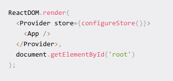

# Redux

`npm i --save redux react-redux`

The redux package is for a global state.  Provides a state management library.  One state for the entire app.

The react-redux package is for the interactin between react and redux (redux can be used with other FE techs like Angular).

---

### Actions

Objects that should have 2 properties,
1. type of action
2. description of what should be changed in the state.

### Reducers

Functions that implement behaviour of the actions.  Change state based on action.

### Store

Global state storage.

---

Create `store.js` in `src` folder

This code is example specific

---

`import {connect} from 'react-redux'` 

Also import the actions (objects).

Use `connect` to make the connection between the store and this file that you want to have access to the state store.  

Connect takes 2 paraments
1. mapStateToProps - used to retive the store state
2. mapDispatchToProps - used to tretieve the actions and dispath them to the store
Define these before export default.

`export default connect(mapStateToProps, mapDispatchToProps)(ComponentName);`

---

Tell the application we are using Redux and global state/store

In `index.js`

Then reconfigure the render to 
