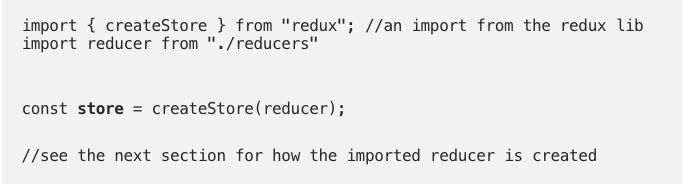

# Redux
# https://levelup.gitconnected.com/an-unforgettable-way-to-learn-redux-f36afd38c966

Think of going to the bank to withdraw money.

Your Intention/Action is to withdraw_money.

You get to the bank.  You go to the bankteller(REDUCER) to make your intentions known, NOT the vault (REDUX STORE).

The bankteller processes your request and returns with your money.

The vault is to the bank, what is the `redux store` is to redux.  This is the single source of truth.  Info is stored in an object tree and is managed by the redux store.

If you want to update state (like setState in React), you must let redux know your intentions with an `ACTION`.

The ACTION for the bank scenario is "to withdraw money".  In a redux application it is represented by an object.
`{`
&nbsp;&nbsp;&nbsp;`type: "WITHDRAW_MONEY},`
&nbsp;&nbsp;&nbsp;`amount: "$10,000"`
`}`

This object is referred to as an ACTION.  It always has a `TYPE` which describes what action you want to perform.

The only way to change the state is to emit an action/object describing what happened.

Create a store

The CASHIER is to the bank, what the `REDUCER` is to Redux.  Passing an ACTION to a REDUCER is known as `DISPATCHING an ACTION`.  Dispatch means to send off.

The REDUCER will know what to do with the action.  In this example, it looks at the type and amount, and performs interaction with the vault.

Pure reducers is a function that takes in `state` and `action`, and returns a new `state`.

When returning the new state, you should not return mutated state, you should return a new copy of state which has been modified (recreate state each time). 

`PASS YOUR ACTION TO THE REDUCER WHICH INTERACTS WITH THE STORE`