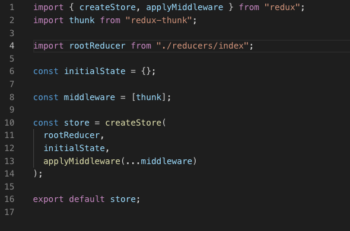

# https://www.youtube.com/watch?v=93p3LxR9xfM&t=2763s

# Redux

Share state between components.

`npm i redux react-redux redux-thunk`

---
 Bring in Provider which is a React component, glue between React and Redux from the react-redux library.
 `import {Provider} from './react-redux';`

 Do this in highest level file, either apps.js or index.js.

 Wrap entire render within `<Provider store={store}>` tags.

---
Create `store.js` in `src` folder   

 `import { createStore, applyMiddleware } from "redux";`     
 `import thunk from "redux-thunk";`
  

createStore() takes 3 parameters
1. root reducer, which is combination of individual reducers
2. initial state
3. enhancer functions

---
create rootReducer in seperate file.

In `src` create `reducers` folder, create `index.js` file as the rootReducer.  Import into `store.js` file as above.

Combine individual reducers using the combineReducers function in redux.

`import { combineReducers} from 'redux';`

import reducers which will be created individually in the reducers foler.

`export default combineReducers({givenName: importedReducerName, etc})`   
use given name as alias for individual reducers.

---
Create `actions` folder in `src`.

These are objects with a `type`.