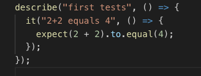

# Cypress

UI automated testing.  End to end testing.

`npm i --save-dev cypress`

run using `node_modules/.bin/cypress open` (as shown)

Cypress folder now in the root directory.

---
Add new test file to root/`cypress/integration` file with fileName_spec.js.  eg(maps_spec.js).

This is now an available test case in Cypress.  Click, to launch this test in the Cypress test runner.

Write test in the file using `describe`, `it` and `expect`.

---
Tests usually
1. Arrange - setup intial app state, eg visit a page
2. Act - take an action, eg find an element
3. Assert - make an assertion

---
 For test setup, use `cy.visit('url')` to get to a landing page to start testing individual parts.

 To target a part of the page, we can use `cy.contains('some text')` which looks for a string on the page.

 Chain `.click()` to perform a click on the element selected.  eg. `cy.contains('CSS grid').click()`.

 Click on any test to expand.

