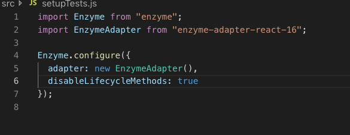
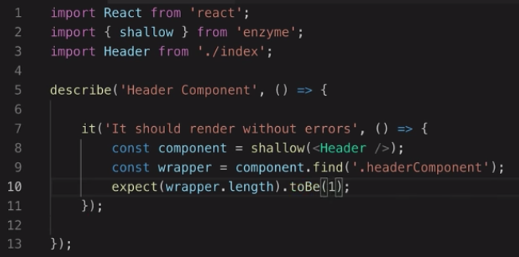
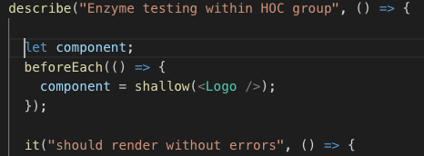
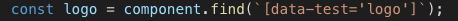
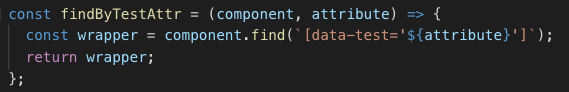

# Enzyme

`npm install --save-dev jest enzyme enzyme-adapter-react-16 jest-enzyme`

---
To configure enzyme, create `setupTests.js` file in the `src` folder.

---
Files to be tested include `spec.js` and `COMPONENT_NAME.test.js`.

This here is looking for classNames within the shallow render.  It is looking for class `headerComponent`, expecting there should only be one within the render.

Can add `console.log(component.debug());` after `const component` to see exactly what shallow is looking at.

---
If you are doing multiple tests on the same component, each `it` will begin with the same line `const component = shallow(<Header/>)`.

Refactor by moving this line outside of each `it` block.  Put within the grouping `describe block`.

Now `component` will be called before each `it` block and is globally available to all tests within the describe block.

---
Use `data-test` attribute for component instead of `className`, as more explicit what the attribute is for, therefore more unlikely to be accidentally changed. 

Must change `component.find`. No longer looking for className, look for data-test. 

---
ADVANCED

Repetitive find in each test.  Create a function outside describe.

Then just call function in `it` block
`const logo = findByTestAttr(component, 'logo');`

Ultimately remove this from this file and have in a utility folder.  Then import to each test file.

---
use `expect(wrapper.text()).toEqual('text');` to check if text displayed by component is what you expect.

