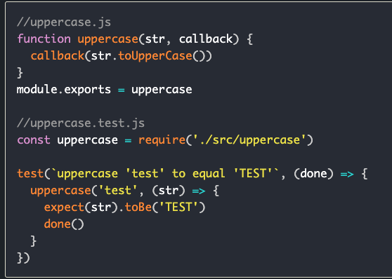

# Jest Testing

`npm i --save-dev jest`

In package.json, add a script to run jest eg `"test" : "jest"`

put tests in `generalName.test.js`.  Jest will look for the .test.js and run this file when you run `npm run test`.

---
General syntax

`describe ('Group of tests description', () => {`      
&nbsp;&nbsp;    `test ('what you are testing for', () => {`     
       &nbsp;&nbsp;&nbsp;&nbsp; `expect ('run some code').MATCHER('expected output')`     
  &nbsp;&nbsp;  `})`      
`})`

---
### ***Matchers***

`.toBe` tests for equality (`===`).     
eg.     &nbsp;&nbsp;`expect (2+2).toBe(4);`

`.toEqual` tests for object equality, see if two objects/arrays have the same contents.

---
### Truthy and Falsy Matchers

`.toBeNull`

`.toBeUndefined`

`.toBeDefined`

`.toBeTruthy`

`.toBeFalsy`

Can use `.not` before any of these to test the opposite.      
eg.  `.not.toBeDefined` === `.toBeUndefined`.

---
### Numbers

`.toBeGreaterThan`

`.toBeGreaterThanOrEqual`

Same for lest than.

Use `toBe` and `toEqual` is comparing numbers.

For floating point numbers, use `toBeCloseTo` to take into account the rounding error.

---
### Strings

Use `.toMatch` and use regular expressions.       
eg. &nbsp;&nbsp; &nbsp;&nbsp;`expect ('Christopher').toMatch(/stop/);`

---
### Arrays

Use `.toContain` to test if array contains element.

---
### ***Async code***

### Callbacks

Test callbacks using `done` as the parameter in the describe section, and then call it after the expect statement.

